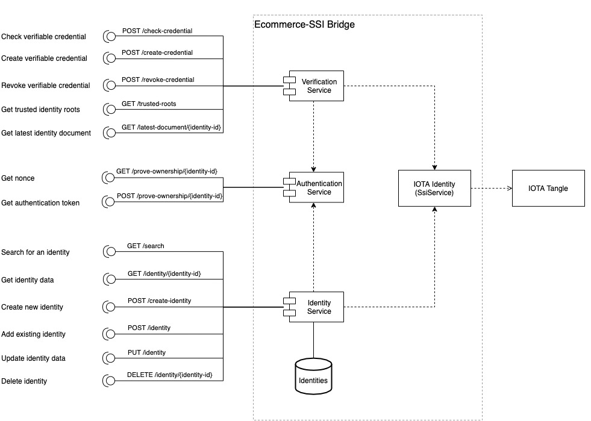
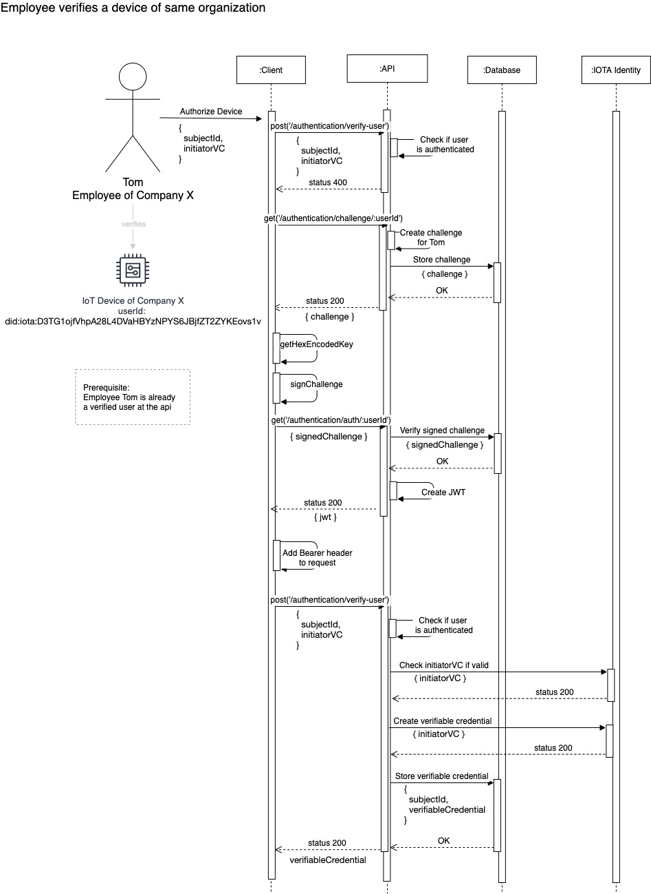

# Ecommerce-SSI Bridge

The Ecommerce-SSI Bridge allows users to create self sovereign identities and decentralized identifiers ([DID Documents](https://www.w3.org/TR/did-core/)) for organizations, persons and objects. Each identity is represented by a unique public key immutably stored onto the ledger. Identities and public keys are used to anchor off chain Verifiable Credentials ([VCs](https://www.w3.org/TR/vc-data-model/)), certificates contaning identity attributes and signed by an Issuer identity. 

Issuer itself is an entity with its own decentralized identity. The Bridge allows an identified trust root to verify users identity. Verified identities can then progate this verification to other entities (organizations, persons, objects) using a network of trust approach (see figure below). 


The Bridge also allows Issuers to issue Verifiable Credentials for selected Owners (identified by a decentralized identity) and Owners to present them to Verifiers. Verifiers can use the Ecommerce-SSI Bridge APIs to verify credentials authenticity. This requires to verify that a credentila contains the identifier of the owner presenting it, and it is signed by an authorised Issuer. This requires to access the information stored onto a ledger.

The image below shows the interaction between Issuer, Owner, Verifier and the ledger to manage the lifecycle of decentralized identities and verifiable credentials.


Our Ecommerce-SSI Bridge provides an abstraction layer through REST APIs that allows entities to create decentralized identities (the identity), verify them, attach verifiable credentials and verify them.

The figure below shows the envisioned system architecture (within the full set of IOTA ecommerce tools for ENSURESEC).


Below we provide examples on how the Bridge could be used in the context of ecommerce ecosystems, in particular: 1) secure goods distribution 2) secure sales.

## Ecommerce example scenarios: secure goods distribution
### 1. Delivery company identity and scanners verification ###

__Problem__: Proof of Delivery: avoid goods being stolen in transit; avoid threats and frauds in the distribution chain 

In the context of ENSURESEC e-commerce ecosystem, the proposed use case will make use of the Ecommerce-SSI Bridge to implement the following workflow:
* An authorised employee of a delivery company registers an _organization_ decentralized identity for its company using the Ecommerce-SSI Bridge
* An e-commerce operator verifies the delivery company identity and use the Bridge to issue a credential for the company to deliver on their behalf
* The authorised employee of the registered delivery company registers decentralized identities for the scanners (i.e. android scanners) used by the company couriers
* The authorised employee use the Ecommerce-Bridge to issue authorisation credentials for handling delivery to each courier device (with the credential stored locally into the device)
* When a courier hands over the delivery the scanner uses the Ecommerce-SSI Bridge to present its credential to the e-commerce operator
* The e-commerce operator uses the Ecommerce-SSI Bridge to verify that the parcel was handled by the authorised courier and not stolen in transit

### 2. Customer identity and delivery verification ###

__Problem__: Proof of Collection: guarantee goods being collected by the right customer; avoid threats and frauds in the distribution chain 

In the context of ENSURESEC e-commerce ecosystem, the proposed use case will make use of the Ecommerce-SSI Bridge to implement the following workflow:
* A user creates a decentralized identity (DID document) using a mobile application (a standalone credential wallet or an e-commerce shopping app)
* A user performs a purchase on an e-commerce site (see below use case 2 in case of age verification is required)
* The e-commerce site uses the Ecommerce-SSI Bridge to issue a proof of purchase credential to the user (this is saved to the user phone) 
* The user receives the good delivery and present the credential in the form af a QR code to the courier scanner
* The courier acquires the credential and uses the Ecommerce-Bridge to verify its authenticity; the delivery is safely handled over to the right customer
* (optionally) The user acquires the courier scanner credential (see above, use case 1) and uses the Ecommerce-SSI Bridge to verify that it belongs to an authorised dleivery company; the user (customer) knows the delivery is legit

_The two scenarios above become even more interesting in case of automated (i.e., drones) delivery. And when including also delivery identification._

## Ecommerce example scenarios: secure sales
### 1. Customer identity and credential (age) verification ###

__Problem__: Verify customer identity and avoid to collect and store personal information; increasing compliance and reducing liability.

In the context of ENSURESEC e-commerce ecosystem, the proposed use case will make use of the Ecommerce-SSI Bridge to implement the following workflow:
* An authorised bank employee registers an _organization_ decentralized identity for its bank
* A user creates a decentralized identity (DID document) using a mobile application (a standalone credential wallet or an e-commerce shopping app)
* The user requests an Issuer (e.g., the bank) to issue a credential staying her age
* The issuer uses information about the user held on local record (and previously verified) and the Ecommerce-SSI Bridge to create and issue a Verifiable Credential to the user
* The user (namely Owner) downloads the credential in her app, using a credential wallet
* The user purchases a verified age item on an e-commerce site
* The user provides her credential to the e-commerce website using the Ecommerce-SSI Bridge
* The e-commerce site uses the Ecommerce-SSI Bridge to verify the credential and authorise the purchase

### 2. Seller identity verification ### 

__Problem__: Verify sellers identity and product authenticity; reducing small sellers compliance burden.

In the context of ENSURESEC e-commerce the proposed use case will make use of the Ecommerce-SSI Bridge to implement the following workflow:
* An e-commerce site allows a seller authorised employee to create a decentralized identity (DID document for organization) using the Ecommerce-SSI Bridge
* The seller requests an Issuer (e.g., its bank) to issue a credential stating its KYC (Know Your Customer) status
* The seller presents the credentials to the e-commerce site operator using the Ecommerce-SSI Bridge
* The e-commerce site operator verifies the seller credentials using the Ecommerce-SSI Bridge and allow the seller to trade on its marketplace
#### 2.1 Product identity and authenticity
* The e-commerce site allows the seller to create a decentralized identity for each of its products (DID document for product) using the Ecommerce-SSI Bridge
* The e-commerce site allows the seller to create and sign an authenticity credential associated to a given product identity using the Ecommerce-SSI Bridge
* A user app allows a customer to obtain the product authenticity credential (scanning a QR from an e-commerce site or directly attached to a purchased product)
* A user app allows a customer to verify signature of the product authenticity credential using the Ecommerce-SSI Bridge (including verification of the seller identity)


## Ecommerce-SSI Bridge APIs Definition
The list of provided APIs is shown in figure below.



### Authentication Service 
__Prefix:__ `/api/v1/authentication`


`GET /trusted-roots`

Returns a list of trusted root identity IDs. Trusted roots are IDs of identities which are trusted by the bridge. This identity IDs can be IDs of other companies, by adding them to the list trusted roots their verifiable credentials are trusted when checking at the bridge.

`GET /latest-document/{user-id}`

Get the latest version of an identity document from the tangle.

`POST /create-identity`

Create a new decentralized digital identity. It will be signed and published to the tangle! A digital identity can represent a device, user or even an organization. Do not lose the privateAuthKey, since it won’t be stored on the API side and do only store it encrypted.

`GET /check-verification`

Check the verifiable credential of a user. Validates the signed verifiable credential against the tangle and checks if the issuer id of the credential is a trusted root.

`POST /verify-user`

Verify a user, device or organization etc. at the api. Only verified users with assigned privileges can verify other identities at the api. Having a verified identity provides the opportunity that other users are able to identify and verify a subscriber by the verifiable credential. 

`POST /revoke-verification`

Remove the verification of a user. Reasons could be, that the user has left the organization. Only organization admins, the initiator or the user itself can do that!

`GET /prove-ownership/{user-id}`

Request a nonce which must be signed by the private key of the client and send it to /prove-ownership/{user-id} endpoint via POST.

`POST /prove-ownership/{user-id}`

Get an authentication token by signing a nonce using the private key, if it is signed correctly a JWT string will be returned in the response. The nonce can be received from `GET /prove-ownership/{user-id}` endpoint. 

### User Service 

__Prefix:__ `/api/v1/users`

`GET /search`

Search for users in the system which returns a list of queried users in the system. 

`GET /user/{user-id}`

Get information about a specific user by its user-id. 

`PUT /user`

Update user data of an existing user.

`POST /user`

Register a new user in the system, this can be used if the identity already exists or will be created locally. Registering a user in the system makes it possible to search for him by for instance the username.

`DELETE /user/{user-id}`

Removes a user from the system. A user can only delete itself and is not able to delete other users. Administrators are able to remove other users.


## HowTo: Create and verify an identity of a device

In the following we focus on the secure goods distribution scenario.
In order to interact with other users in a trusted way there are three major calls to be done which are described in the section 1, 2 & 3.

### 1. Create an identity

The creation of an identity is one of the key aspects when interacting with other users. By creating an identity, a user creates a public/private key pair. The public key represents the user public identity, represented by a DID document stored onto the IOTA ledger. The private key is kept secret and used to prove ownership that the identity belongs to a specific user. Ownership of the private key allows the user to proof the identity ownership. Furthermore it is possible to add several information (attributes; espressed in forms of Verifiable Credentials, VCs) about a given identity, such as a name or to which company the user belongs to. This attributes are expressed in the form of Verifiable Credentials, statements about a user, signed by a third party (using its identity and corresponding private key). 

Currently the SSI Bridge supports five data models: `Device`, `Person`, `Organization`, `Service` and `Product`. These are the types which will be validated and are derived by adapting the data models of https://schema.org. In addition, the implementation allows to define custom user's types, to fulfil the need of use cases with different data types. The type of a user is defined by the field type; if an unknown type is provided, the api will reject it.

> The exact data model definition can be found here: https://gist.github.com/dominic22/186f67b759f9694f45d35e9354fa5525

The following snippet demonstrates an example where an identity of a device will be created. Since schema.org does not have a data model for devices, the device data model of FIWARE was used.

https://ensuresec.solutions.iota.org/api/v0.1/authentication/create-identity

The body of the POST request contains the Device type, an organization id, username and a data field which contains detailed information about the device.

```
{
  "username": "iota-test-device",
  "type":"Device",
  "organization":"did:iota:Hkac4k6xsuDdn7fQms6yMJsySRDDC4fH962MwP9dxWse",
  "data": {
        "category": ["sensor"],
        "controlledProperty": ["fillingLevel","temperature"],
        "controlledAsset":["wastecontainer-Osuna-100"],
        "ipAddress": ["192.14.56.78"],
        "mcc": "214",
        "mnc": "07",
        "batteryLevel": 0.75,
        "serialNumber": "9845A",
        "refDeviceModel":"myDevice-wastecontainer-sensor-345",
        "rssi": 0.86,
        "value": "l=0.22;t=21.2",
        "deviceState": "ok",
        "dateFirstUsed": "2014-09-11T11:00:00Z",
        "owner": ["http://person.org/leon"]
    }
}
```

The request returns the following body:

```
{
    "doc": {
        "id": "did:iota:Bn7kHRVydhZfJDhzErLh1CKFYY8Bhn5GCQwLzbWuZhj",
        "authentication": [
            {
                "id": "did:iota:Bn7kHRVydhZfJDhzErLh1CKFYY8Bhn5GCQwLzbWuZhj#key",
                "controller": "did:iota:Bn7kHRVydhZfJDhzErLh1CKFYY8Bhn5GCQwLzbWuZhj",
                "type": "Ed25519VerificationKey2018",
                "publicKeyBase58": "4iGULWnqjbKtf4KxkZYtLvcJHsQvgJY5jndK1esXU1Dv"
            }
        ],
        "created": "2021-05-27T12:55:19Z",
        "updated": "2021-05-27T12:55:19Z",
        "proof": {
            "type": "JcsEd25519Signature2020",
            "verificationMethod": "#key",
            "signatureValue": "43XkMJjQNFi8z9KeNMNf1Fngy8GK2XXe68poiQzBKmtJcMC8potYzypwtMkBavGNg5bE1RLxHs4io2GipnqsMXNA"
        }
    },
    "key": {
        "type": "ed25519",
        "public": "4iGULWnqjbKtf4KxkZYtLvcJHsQvgJY5jndK1esXU1Dv",
        "secret": "21S97sdJpYBqqfgoEMmonWAQryXanQAoCuqPTcJHSV5V",
        "encoding": "base58"
    },
    "txHash": "eda7001adc5e8c9b9b473ca6586cfe9deab3f19e4ce9fba0bbead09e5b649dce"
}
```

The `key` field of the body is the essential part which must be stored by the client, since it contains the public/private key pair which is used to authenticate at the api.

### 2. Authentication and authorise an identity

An identity can be used to authenticate a user to a number of services provided by the Bridge. For accessing the service at several endpoints an identity needs to be authenticated by using the public/private key pair which is generated when creating an identity. Endpoints which need client authentication for the SSI bridge are as following:

- get('/users/search')
- put('/users/user')
- delete('/users/user/:userId')
- post('/authentication/verify-user')
- post('/authentication/revoke-verification')

How the client can authenticate at the api is described in the following sequence diagram which refers to verify user (section 3) as an example.



As described in the sequence diagram the client must request and then sign a nonce in order to being able to authenticate at the api. Therefore two scripts must be implemented by the client `getHexEncodedKey` & `signNonce` which are described in the following:

```
import * as ed from 'noble-ed25519';
import * as bs58 from 'bs58';

// Decode a base58 key and encode it as hex key. (Needed for signNonce & verifySignedNonce)
export const getHexEncodedKey = (base58Key: string) => {
	return bs58.decode(base58Key).toString('hex');
};

// hash a string
const hashNonce = (nonce: string) => crypto.createHash('sha256').update(nonce).digest().toString();

// Sign a nonce using the private key.
export const signNonce = async (privateKey: string, nonce: string): Promise<string> => {
	const hash = hashNonce(nonce);
	return await ed.sign(hash, privateKey);
};
```

To verify an identity ownership and to authenticate the user against a corresponding endpoint, first of all a nonce must be created by the api endpoint. This is triggered by calling the selected endpoint with the userId that requires authentication via __GET__. An example is:

https://ensuresec.solutions.iota.org/api/v0.1/authentication/prove-ownership/did:iota:7Vk97eWqUfyhq92Cp3VsUPe42efdueNyPZMTXKUnsAJL

It returns a json object with the generated nonce:

```
{
    "nonce":"25110bd1742ebcabdc9962819a181e91515d51aa"
}
```

This nonce must now be signed using the private key of the user keypair and sent back to the `prove-ownership` endpoint via POST, which then returns a JWT string, in case the nonce was successfully signed. This JWT can then be transformed into a Bearer token and be added into the Authorization header of the request.

Signing the nonce by the client can be done with the following two function calls.

```
const encodedKey = await getHexEncodedKey(identity.key.secret);
const signedNonce = await signNonce(encodedKey, nonce);
```

This nonce must then be sent to the following api via POST request:

https://ensuresec.solutions.iota.org/api/v0.1/authentication/prove-ownership/did:iota:Ced3EL4XN7mLy5ACPdrNsR8HZib2MXKUQuAMQYEMbcb4

As body of the request the `signedNonce` must be added like following:

```
{ signedNonce: 'thisisthecontentofthesignednonce' }
```

A more detailed usage script how to integrate the authentication into a typescript client can be found in the following:

```
export const fetchAuth = async (identity: any) => {
	console.log('requesting nonce to sign...');

	const url = `${Config.baseUrl}/api/v1/authentication/prove-ownership/${identity.doc.id}`;
	const res = await axios.get(url);
	if (res.status !== 200) {
		console.error('didnt receive status 200 on get request for prove-ownership!');
		return;
	}
	const body = await res.data;
	const nonce: string = body.nonce;
	console.log('received nonce: ', nonce);

	const encodedKey = await getHexEncodedKey(identity.key.secret);
	const signedNonce = await signNonce(encodedKey, nonce);
	console.log('signed nonce: ', signedNonce);

	console.log('requesting authentication token using signed nonce...', identity.doc.id);
	const response = await axios.post(`${Config.baseUrl}/api/v1/authentication/prove-ownership/${identity.doc.id}`, JSON.stringify({ signedNonce }), {
		method: 'post',
		headers: { 'Content-Type': 'application/json' }
	});

	return response;
};
```

### 3. Verify the device identity

Everyone can create an identity and add any data to such identity, that is why it is needed to know if the person or device really belongs to the company they claim to be. Hence their identity must be verified. This can be done by an administrator of the SSI bridge or an already verified user of an organization (based on the principle of network of trust described above). Upon verification, the system allows to create a so called verifiable credential, which contains information about the identity and a signature proof of the information of the verifier, so that authenticity of data in the verifiable credential can not be changed later but verified. In this case we verify the previously generated device identity by an already authorized user with the following verifiable credential:

```
{
    "@context": "https://www.w3.org/2018/credentials/v1",
    "id": "did:iota:EVyQGzBQ3Rb71mJDhrRbU8kFDxwG6BE6QM5zafsdm1AF",
    "type": [
        "VerifiableCredential",
        "PersonCredential"
    ],
    "credentialSubject": {
        "id": "did:iota:EVyQGzBQ3Rb71mJDhrRbU8kFDxwG6BE6QM5zafsdm1AF",
        "@context": "https://schema.org/",
        "familyName": "User2",
        "givenName": "Test",
        "initiatorId": "did:iota:AUKN9UkJrTGGBcTZiYC3Yg2FLPQWnA11X8z6D6DDn56Y",
        "jobTitle": "Software Engineer",
        "name": "Test User2",
        "organization": "did:iota:Hkac4k6xsuDdn7fQms6yMJsySRDDC4fH962MwP9dxWse",
        "registrationDate": "2021-05-27T16:34:16+02:00",
        "type": "Person"
    },
    "issuer": "did:iota:9XuKdCzfNUiSCSFsT8DaECkn5sSCvCp485haAi8msCAG",
    "issuanceDate": "2021-05-27T14:34:33Z",
    "proof": {
        "type": "MerkleKeySignature2021",
        "verificationMethod": "#key-collection",
        "signatureValue": "6LLcqhhPitusDrUWZd7gXVoQcX1h2bC5BYAETLySVapF.1113qJALtPxJbo3MzM5fNigaLaDc8SVuac6GJJGP2Fj6Ca5muDaKV9xvco3x5gRXNPuNgKZHJ6u3FUJrrHwScxTL5twHSViUKS7AoAFcYHfQW5ExJnAEzAaUuCek8fk7greu6UtjByW6SBHgasU5rKgoLgvhHzrkwzMyUWdNr5MPT42hboQDcZuGYvVQVjWwFVNqCQPGBc7KQQs3Msh2wYtQaRue6v9YS9ShdUFunzKCFseCEXeUSXR657Ya6XNhBY1wDwWry1MKmZ83jX9YBoieUyKMNmeNwmY3gV3PFvY5jZ8nzr3SaZwTNY5xdbuaPjznca9rjXJ8mcLqtezadEejRu3GBXFpNNkKmveSFr1t7UFeJ8mDLAPJcb2FtBQDoJzmLNc6cboASuhPuzfVemHLMEchUmQbGjq2xruynpWWc676Twsfxr7sVxonwE9imXC8jF2.2jug5Ud38XQjNiV4gvkqAxdKVmneWbf1W3j2ugYFTHZkunMZ1hSNfzHdnEKVemjdaSTj1eoJaodcwLXNvrYx4xdZ"
    }
  }
```

The endpoint of this request is as following:

https://ensuresec.solutions.iota.org/api/v0.1/authentication/verify-user

> As described in section 2, the request must be authenticated by having a valid Bearer token in the Authorization header otherwise the api returns a "401 Unauthorized" status code.

The api body must contain the userId of the identity which needs to be verified in the `subjectId` field. Furthermore, if the user is not an administrator it needs to add a verifiable credential which was generated when verifying itself. This verifiable credential is stored by the api and can be requested at the GET `/user/{user-id}` api. How to request the verifiable credential at the api will be described in section 4. As discussed, the verifiable credential must be part of the request body, if the verification request is not initiated by an admin. Add the verifiable credential in the `initiatorVC` field since it is the initiator which verifies the device. The request could look like the following:

```
{
  "subjectId": "did:iota:Bn7kHRVydhZfJDhzErLh1CKFYY8Bhn5GCQwLzbWuZhj",
  "initiatorVC": {
    "@context": "https://www.w3.org/2018/credentials/v1",
    "id": "did:iota:EVyQGzBQ3Rb71mJDhrRbU8kFDxwG6BE6QM5zafsdm1AF",
    "type": [
        "VerifiableCredential",
        "PersonCredential"
    ],
    "credentialSubject": {
        "id": "did:iota:EVyQGzBQ3Rb71mJDhrRbU8kFDxwG6BE6QM5zafsdm1AF",
        "@context": "https://schema.org/",
        "familyName": "User2",
        "givenName": "Test",
        "initiatorId": "did:iota:AUKN9UkJrTGGBcTZiYC3Yg2FLPQWnA11X8z6D6DDn56Y",
        "jobTitle": "Software Engineer",
        "name": "Test User2",
        "organization": "did:iota:Hkac4k6xsuDdn7fQms6yMJsySRDDC4fH962MwP9dxWse",
        "registrationDate": "2021-05-27T16:34:16+02:00",
        "type": "Person"
    },
    "issuer": "did:iota:9XuKdCzfNUiSCSFsT8DaECkn5sSCvCp485haAi8msCAG",
    "issuanceDate": "2021-05-27T14:34:33Z",
    "proof": {
        "type": "MerkleKeySignature2021",
        "verificationMethod": "#key-collection",
        "signatureValue": "6LLcqhhPitusDrUWZd7gXVoQcX1h2bC5BYAETLySVapF.1113qJALtPxJbo3MzM5fNigaLaDc8SVuac6GJJGP2Fj6Ca5muDaKV9xvco3x5gRXNPuNgKZHJ6u3FUJrrHwScxTL5twHSViUKS7AoAFcYHfQW5ExJnAEzAaUuCek8fk7greu6UtjByW6SBHgasU5rKgoLgvhHzrkwzMyUWdNr5MPT42hboQDcZuGYvVQVjWwFVNqCQPGBc7KQQs3Msh2wYtQaRue6v9YS9ShdUFunzKCFseCEXeUSXR657Ya6XNhBY1wDwWry1MKmZ83jX9YBoieUyKMNmeNwmY3gV3PFvY5jZ8nzr3SaZwTNY5xdbuaPjznca9rjXJ8mcLqtezadEejRu3GBXFpNNkKmveSFr1t7UFeJ8mDLAPJcb2FtBQDoJzmLNc6cboASuhPuzfVemHLMEchUmQbGjq2xruynpWWc676Twsfxr7sVxonwE9imXC8jF2.2jug5Ud38XQjNiV4gvkqAxdKVmneWbf1W3j2ugYFTHZkunMZ1hSNfzHdnEKVemjdaSTj1eoJaodcwLXNvrYx4xdZ"
    }
  }
}
```

The api then checks if the subjectId exists at the api and belongs to the same organization, furthermore it checks if the verifiable credential of the initiator is valid. If both applies, a verifiable credential for the subjectId is created and stores the credential in the subjects' user data, in addition it returns the verifiable credential of the device in the response, as seen in the following:

```
{
    "@context": "https://www.w3.org/2018/credentials/v1",
    "id": "did:iota:Bn7kHRVydhZfJDhzErLh1CKFYY8Bhn5GCQwLzbWuZhj",
    "type": [
        "VerifiableCredential",
        "DeviceCredential"
    ],
    "credentialSubject": {
        "id": "did:iota:Bn7kHRVydhZfJDhzErLh1CKFYY8Bhn5GCQwLzbWuZhj",
        "@context": [
            "https://smartdatamodels.org/context.jsonld"
        ],
        "batteryLevel": 0.75,
        "category": [
            "sensor"
        ],
        "controlledAsset": [
            "wastecontainer-Osuna-100"
        ],
        "controlledProperty": [
            "fillingLevel",
            "temperature"
        ],
        "dateFirstUsed": "2014-09-11T11:00:00Z",
        "deviceState": "ok",
        "initiatorId": "did:iota:EVyQGzBQ3Rb71mJDhrRbU8kFDxwG6BE6QM5zafsdm1AF",
        "ipAddress": [
            "192.14.56.78"
        ],
        "mcc": "214",
        "mnc": "07",
        "organization": "did:iota:Hkac4k6xsuDdn7fQms6yMJsySRDDC4fH962MwP9dxWse",
        "owner": [
            "http://person.org/leon"
        ],
        "refDeviceModel": "myDevice-wastecontainer-sensor-345",
        "registrationDate": "2021-05-27T14:55:36+02:00",
        "rssi": 0.86,
        "serialNumber": "9845A",
        "type": "Device",
        "value": "l=0.22;t=21.2"
    },
    "issuer": "did:iota:9XuKdCzfNUiSCSFsT8DaECkn5sSCvCp485haAi8msCAG",
    "issuanceDate": "2021-05-27T14:45:51Z",
    "proof": {
        "type": "MerkleKeySignature2021",
        "verificationMethod": "#key-collection",
        "signatureValue": "BPLQaMjNEP5H27U9NmHA8gaAHRrYH2oHB7Qgpaufnm82.1113c6Jy3MFVwQFyDMG7QmbZJ89S72R8DwUHc6eNEwddUQow8rPxYrHzMM7Db5MdRF5JDDSoorHqio6h877HZY2654br4RxBpNd5K4Y6CLLthuxmDrWHz93kAHfr7vcrVyYLDCq5Uc8ENWbTWChSFpZ1AzLXxz2PJu82HqZAZcDZZgPBsRX6y2mS1AGih7Js44eTY9iuCR5nAuuXP4TjXxABWujdmVSXp5MyRLGmSeg5jr3bkmJCmwqvWPBYpRL9mCt7g7xsqgop6epjqqB7e351xbAXfkMsrArkeKvmgAh9YMvhdQgaYVgc9Mp1cvySRWGnj8mQVtzVQicbWuEx9UTRvgm4um16Ne2BnaX4BManN5yarfvqJTsXwtNYGC6HnCuD1GjXhPYtmg2Nr9xUBKMdqnpWojZGAKBgHNsRKU2dK1sDyu7x67Tr2ituVThy9eHPfdE.5kDCcE65y9tNadgQWKdLkYLFPofpP9cZ5e1x746EijMJmXPPL3DTpZ9MNXr6WhJGe9YH4ffMJ31i9P7hMKPJkNTp"
    }
}
```

### 4. Get user data of the device

The verified device can now be requested to provide information about by using the userId. If a user is verified, can be seen by the `verification.verified` field but also by checking the verifiable credentials of the `verifiableCredentials` array. To check whether the verifiable credential is still valid and not revoked the request in section 5 can be used.

But first request the user by his userId with a GET request at the api:

https://ensuresec.solutions.iota.org/api/v0.1/users/user/did:iota:Bn7kHRVydhZfJDhzErLh1CKFYY8Bhn5GCQwLzbWuZhj

The response contains now all information of the device like for instance its username, data but also the verifiableCredentials of the device.

```
{
    "userId": "did:iota:Bn7kHRVydhZfJDhzErLh1CKFYY8Bhn5GCQwLzbWuZhj",
    "publicKey": "4iGULWnqjbKtf4KxkZYtLvcJHsQvgJY5jndK1esXU1Dv",
    "username": "iota-test-device",
    "type": "Device",
    "registrationDate": "2021-05-27T14:55:36+02:00",
    "verification": {
        "verified": true,
        "verificationDate": "2021-05-27T16:45:52+02:00",
        "lastTimeChecked": "2021-05-27T16:45:52+02:00",
        "verificationIssuerId": "did:iota:9XuKdCzfNUiSCSFsT8DaECkn5sSCvCp485haAi8msCAG"
    },
    "organization": "did:iota:Hkac4k6xsuDdn7fQms6yMJsySRDDC4fH962MwP9dxWse",
    "data": {
        "category": [
            "sensor"
        ],
        "controlledProperty": [
            "fillingLevel",
            "temperature"
        ],
        "controlledAsset": [
            "wastecontainer-Osuna-100"
        ],
        "ipAddress": [
            "192.14.56.78"
        ],
        "mcc": "214",
        "mnc": "07",
        "batteryLevel": 0.75,
        "serialNumber": "9845A",
        "refDeviceModel": "myDevice-wastecontainer-sensor-345",
        "rssi": 0.86,
        "value": "l=0.22;t=21.2",
        "deviceState": "ok",
        "dateFirstUsed": "2014-09-11T11:00:00Z",
        "owner": [
            "http://person.org/leon"
        ]
    },
    "verifiableCredentials": [
        {
            "@context": "https://www.w3.org/2018/credentials/v1",
            "id": "did:iota:Bn7kHRVydhZfJDhzErLh1CKFYY8Bhn5GCQwLzbWuZhj",
            "type": [
                "VerifiableCredential",
                "DeviceCredential"
            ],
            "credentialSubject": {
                "id": "did:iota:Bn7kHRVydhZfJDhzErLh1CKFYY8Bhn5GCQwLzbWuZhj",
                "@context": [
                    "https://smartdatamodels.org/context.jsonld"
                ],
                "batteryLevel": 0.75,
                "category": [
                    "sensor"
                ],
                "controlledAsset": [
                    "wastecontainer-Osuna-100"
                ],
                "controlledProperty": [
                    "fillingLevel",
                    "temperature"
                ],
                "dateFirstUsed": "2014-09-11T11:00:00Z",
                "deviceState": "ok",
                "initiatorId": "did:iota:EVyQGzBQ3Rb71mJDhrRbU8kFDxwG6BE6QM5zafsdm1AF",
                "ipAddress": [
                    "192.14.56.78"
                ],
                "mcc": "214",
                "mnc": "07",
                "organization": "did:iota:Hkac4k6xsuDdn7fQms6yMJsySRDDC4fH962MwP9dxWse",
                "owner": [
                    "http://person.org/leon"
                ],
                "refDeviceModel": "myDevice-wastecontainer-sensor-345",
                "registrationDate": "2021-05-27T14:55:36+02:00",
                "rssi": 0.86,
                "serialNumber": "9845A",
                "type": "Device",
                "value": "l=0.22;t=21.2"
            },
            "issuer": "did:iota:9XuKdCzfNUiSCSFsT8DaECkn5sSCvCp485haAi8msCAG",
            "issuanceDate": "2021-05-27T14:45:51Z",
            "proof": {
                "type": "MerkleKeySignature2021",
                "verificationMethod": "#key-collection",
                "signatureValue": "BPLQaMjNEP5H27U9NmHA8gaAHRrYH2oHB7Qgpaufnm82.1113c6Jy3MFVwQFyDMG7QmbZJ89S72R8DwUHc6eNEwddUQow8rPxYrHzMM7Db5MdRF5JDDSoorHqio6h877HZY2654br4RxBpNd5K4Y6CLLthuxmDrWHz93kAHfr7vcrVyYLDCq5Uc8ENWbTWChSFpZ1AzLXxz2PJu82HqZAZcDZZgPBsRX6y2mS1AGih7Js44eTY9iuCR5nAuuXP4TjXxABWujdmVSXp5MyRLGmSeg5jr3bkmJCmwqvWPBYpRL9mCt7g7xsqgop6epjqqB7e351xbAXfkMsrArkeKvmgAh9YMvhdQgaYVgc9Mp1cvySRWGnj8mQVtzVQicbWuEx9UTRvgm4um16Ne2BnaX4BManN5yarfvqJTsXwtNYGC6HnCuD1GjXhPYtmg2Nr9xUBKMdqnpWojZGAKBgHNsRKU2dK1sDyu7x67Tr2ituVThy9eHPfdE.5kDCcE65y9tNadgQWKdLkYLFPofpP9cZ5e1x746EijMJmXPPL3DTpZ9MNXr6WhJGe9YH4ffMJ31i9P7hMKPJkNTp"
            }
        }
    ],
    "role": "User"
}
```


### 5. Check verifiable credential

To check whether the verifiable credential is valid the following api can be called:

https://ensuresec.solutions.iota.org/api/v0.1/authentication/check-verification

Simply insert the verifiable credential to check into the body of the POST request.

```
{
    "@context": "https://www.w3.org/2018/credentials/v1",
    "id": "did:iota:Bn7kHRVydhZfJDhzErLh1CKFYY8Bhn5GCQwLzbWuZhj",
    "type": [
        "VerifiableCredential",
        "DeviceCredential"
    ],
    "credentialSubject": {
        "id": "did:iota:Bn7kHRVydhZfJDhzErLh1CKFYY8Bhn5GCQwLzbWuZhj",
        "@context": [
            "https://smartdatamodels.org/context.jsonld"
        ],
        "batteryLevel": 0.75,
        "category": [
            "sensor"
        ],
        "controlledAsset": [
            "wastecontainer-Osuna-100"
        ],
        "controlledProperty": [
            "fillingLevel",
            "temperature"
        ],
        "dateFirstUsed": "2014-09-11T11:00:00Z",
        "deviceState": "ok",
        "initiatorId": "did:iota:EVyQGzBQ3Rb71mJDhrRbU8kFDxwG6BE6QM5zafsdm1AF",
        "ipAddress": [
            "192.14.56.78"
        ],
        "mcc": "214",
        "mnc": "07",
        "organization": "did:iota:Hkac4k6xsuDdn7fQms6yMJsySRDDC4fH962MwP9dxWse",
        "owner": [
            "http://person.org/leon"
        ],
        "refDeviceModel": "myDevice-wastecontainer-sensor-345",
        "registrationDate": "2021-05-27T14:55:36+02:00",
        "rssi": 0.86,
        "serialNumber": "9845A",
        "type": "Device",
        "value": "l=0.22;t=21.2"
    },
    "issuer": "did:iota:9XuKdCzfNUiSCSFsT8DaECkn5sSCvCp485haAi8msCAG",
    "issuanceDate": "2021-05-27T14:45:51Z",
    "proof": {
        "type": "MerkleKeySignature2021",
        "verificationMethod": "#key-collection",
        "signatureValue": "BPLQaMjNEP5H27U9NmHA8gaAHRrYH2oHB7Qgpaufnm82.1113c6Jy3MFVwQFyDMG7QmbZJ89S72R8DwUHc6eNEwddUQow8rPxYrHzMM7Db5MdRF5JDDSoorHqio6h877HZY2654br4RxBpNd5K4Y6CLLthuxmDrWHz93kAHfr7vcrVyYLDCq5Uc8ENWbTWChSFpZ1AzLXxz2PJu82HqZAZcDZZgPBsRX6y2mS1AGih7Js44eTY9iuCR5nAuuXP4TjXxABWujdmVSXp5MyRLGmSeg5jr3bkmJCmwqvWPBYpRL9mCt7g7xsqgop6epjqqB7e351xbAXfkMsrArkeKvmgAh9YMvhdQgaYVgc9Mp1cvySRWGnj8mQVtzVQicbWuEx9UTRvgm4um16Ne2BnaX4BManN5yarfvqJTsXwtNYGC6HnCuD1GjXhPYtmg2Nr9xUBKMdqnpWojZGAKBgHNsRKU2dK1sDyu7x67Tr2ituVThy9eHPfdE.5kDCcE65y9tNadgQWKdLkYLFPofpP9cZ5e1x746EijMJmXPPL3DTpZ9MNXr6WhJGe9YH4ffMJ31i9P7hMKPJkNTp"
    }
}
```

It should return:

```
{
    "isVerified": true
}
```

for verified users and `false` for not verified users. A reason for not verified verifiable credentials could be:

- Data of verifiable credential was altered (so it does not match with the proof hash)
- Verifiable credential got revoked (as described in section 6)


### 6. Revoke verifiable credential

A verifiable credential can be revoked so it is no more verified, a reason therefore could be: A person left the organization or a device broke and got removed by the organization. To revoke the credential the following api must be called via POST:

https://ensuresec.solutions.iota.org/api/v0.1/authentication/revoke-verification

The body of the request contains the `subjectId` which is the userId of the user which credential shall be revoked, in this case the userId of the device. Furthermore the signature of the credential must be part as the `signatureValue` field to identify the verifiable credential which needs to be revoked.

```
{
   "subjectId": "did:iota:Bn7kHRVydhZfJDhzErLh1CKFYY8Bhn5GCQwLzbWuZhj",
   "signatureValue": "BPLQaMjNEP5H27U9NmHA8gaAHRrYH2oHB7Qgpaufnm82.1113c6Jy3MFVwQFyDMG7QmbZJ89S72R8DwUHc6eNEwddUQow8rPxYrHzMM7Db5MdRF5JDDSoorHqio6h877HZY2654br4RxBpNd5K4Y6CLLthuxmDrWHz93kAHfr7vcrVyYLDCq5Uc8ENWbTWChSFpZ1AzLXxz2PJu82HqZAZcDZZgPBsRX6y2mS1AGih7Js44eTY9iuCR5nAuuXP4TjXxABWujdmVSXp5MyRLGmSeg5jr3bkmJCmwqvWPBYpRL9mCt7g7xsqgop6epjqqB7e351xbAXfkMsrArkeKvmgAh9YMvhdQgaYVgc9Mp1cvySRWGnj8mQVtzVQicbWuEx9UTRvgm4um16Ne2BnaX4BManN5yarfvqJTsXwtNYGC6HnCuD1GjXhPYtmg2Nr9xUBKMdqnpWojZGAKBgHNsRKU2dK1sDyu7x67Tr2ituVThy9eHPfdE.5kDCcE65y9tNadgQWKdLkYLFPofpP9cZ5e1x746EijMJmXPPL3DTpZ9MNXr6WhJGe9YH4ffMJ31i9P7hMKPJkNTp"
}
```

After the credential got revoked the verifiable credential can be checked again using the same endpoint and body as in section 5 but not it should return false like following:

```
{
    "isVerified": false
}
```


### 7. Trusted roots

In regard to support verifiable credentials of other systems, the root id of their network of trust can be added to the bridge. For instance if Company X has the id `did:iota:abc` and Company Z `did:iota:xyz`. Company X can add the did `did:iota:xyz` next to his trusted root id to also trust credentials signed by Company Z.

When checking a verifiable credential it checks:

- Is the signature and content of the credential the same
- Is the credential valid or revoked
- Is the issuer id trusted

To receive the list of trusted identities the SSI Bridge offers an endpoint which can be called as the following:

https://ensuresec.solutions.iota.org/api/v0.1/authentication/trusted-roots

It returns all trusted identity ids which are trusted by the api.

```
{
    "trustedRoots": [
        "did:iota:HUReLjBy79sk4Jbah9S56GtRDyGoEskHdQjFXSashKGr",
        "did:iota:8P4uV9haNks6N8aXXLt2Ps3nQtSqGXc2kJM4K6urm62Y"
    ]
}
```

### 8. Get latest document

To receive the latest document of an identity from the tangle, the SSI Bridge also offers an endpoint which can be called via GET.

https://ensuresec.solutions.iota.org/api/v0.1/authentication/latest-document/did:iota:Bn7kHRVydhZfJDhzErLh1CKFYY8Bhn5GCQwLzbWuZhj

It returns information about the identity document of the device on the tangle.

```
{
    "id": "did:iota:Bn7kHRVydhZfJDhzErLh1CKFYY8Bhn5GCQwLzbWuZhj",
    "authentication": [
        {
            "id": "did:iota:Bn7kHRVydhZfJDhzErLh1CKFYY8Bhn5GCQwLzbWuZhj#key",
            "controller": "did:iota:Bn7kHRVydhZfJDhzErLh1CKFYY8Bhn5GCQwLzbWuZhj",
            "type": "Ed25519VerificationKey2018",
            "publicKeyBase58": "4iGULWnqjbKtf4KxkZYtLvcJHsQvgJY5jndK1esXU1Dv"
        }
    ],
    "created": "2021-05-27T12:55:19Z",
    "updated": "2021-05-27T12:55:19Z",
    "proof": {
        "type": "JcsEd25519Signature2020",
        "verificationMethod": "#key",
        "signatureValue": "43XkMJjQNFi8z9KeNMNf1Fngy8GK2XXe68poiQzBKmtJcMC8potYzypwtMkBavGNg5bE1RLxHs4io2GipnqsMXNA"
    }
}
```
