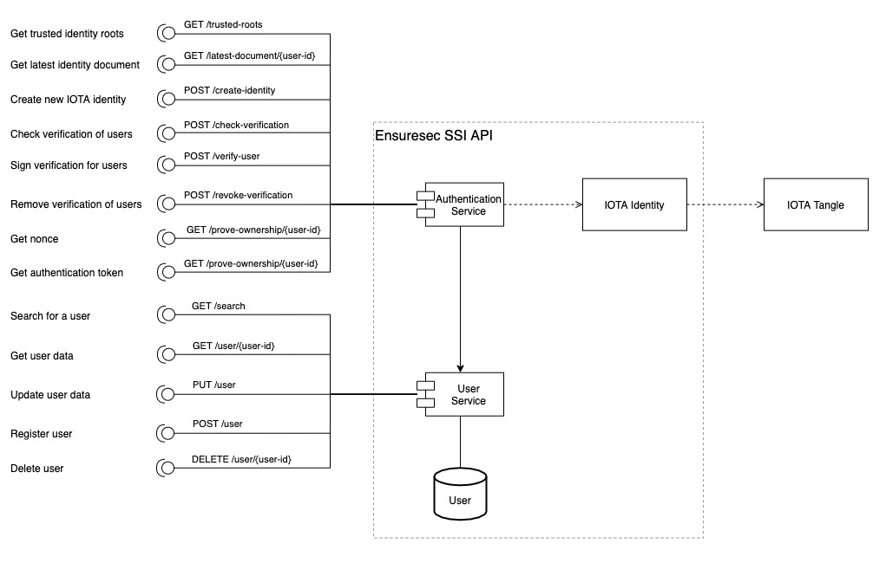

# Ensuresec-SSI Bridge

The Ensuresec-SSI Bridge allows users to create SSI identities and decentralized identifiers ([DID Documents](https://www.w3.org/TR/did-core/)). Each identity is represented by a unique public key immutably stored onto the ledger. Identities and public keys are used to anchor off chain Verifiable Credentials ([VCs](https://www.w3.org/TR/vc-data-model/)), certificates contaning identity attributes and signed by an Issuer identity. 

The Bridge allows an identified trust root to verify users identity and to progate this verification verification using a network of trust approach (see figure below). 


It then allows Issuers to issue Verifiable Credentials for selected Owners and Owners to present them to Verifiers. Verifiers can use the Ensuresec-SSI Bridge APIs to verify credentials authenticity.


The Bridge provides an abstraction layer through REST APIs that allows entity to create decentralized identities (the identity), verify them, attach verifiable credentials and verify them.

An example of the Bridge use is provided below.

## Example
TBD


## SSI-Bridge Api Definition



### Authentication Service 
__Prefix:__ `/api/v1/authentication`


`GET /trusted-roots`

Returns a list of trusted root identity IDs.

`GET /latest-document/{user-id}`

Get the latest version of an identity from the tangle.

`POST /create-identity`

Create a new decentralized digital identity. It will be signed and published to the tangle! A digital identity can represent a device, user or even an organization. Do not lose the privateAuthKey, since it won’t be stored on the API side and do only store it encrypted.

`GET /check-verification`

Check the verification of a user. Validates the signed identity against the tangle and checks if the issuer of the credential is a trusted root.

`POST /verify-user`

Verify a user, device or organization at the api. Only verified users with assigned privileges can verify other identities at the api. Having a verified identity provides the opportunity that other users are able to identify and verify a subscriber or publisher of a channel. 

`POST /revoke-verification`

Remove the verification of a user. Reasons could be, that the user has left the organization. Only organization admins, the initiator or the user itself can do that!

`GET /prove-ownership/{user-id}`

Request a nonce which must be signed by the private key of the client and send it to /prove-ownership/{user-id} endpoint via POST.

`POST /prove-ownership/{user-id}`

Get an authentication token by signing a nonce using the private key, if it is signed correctly a JWT string will be returned in the response. The nonce can be received from `GET /prove-ownership/{user-id}` endpoint. 

### User Service 

__Prefix:__ `/api/v1/users`

`GET /search`

Search for a user in the system which returns a list of queried users in the system. 

`GET /user/{user-id}`

Get information about a specific user by its user-id. 

`PUT /user`

Update user data. 

`POST /user`

Register a new user in the system. Registering a user in the system makes it possible to search for him by the username.

`DELETE /user/{user-id}`

Removes a user from the system. A user can only delete itself and is not able to delete other users. Administrators are able to remove other users.


## Example: Create and verify an identity of a device

In order to interact with other users in a trusted way there are three major calls to be done which are described in the section 1, 2 & 3.

### 1. Create an identity

The creation of an identity is one of the key aspects when interacting with other users. By creating an identity, a user creates a public/private key pair. The public key represents the user public identity, represented by a DID document stored onto the IOTA ledger. The private key is kept secret and used to prove ownership that the identity belongs to a specific user. Ownership of the private key allows the user to proof the identity ownership. Furthermore it is possible to add several information (attributes; espressed in forms of Verifiable Credentials, VCs) about a given identity, such as a name or to which company the user belongs to. This attributes are expressed in the form of Verifiable Credentials, statements about a user, signed by a third party (using its identity and corresponding private key). 

Currently the SSI Bridge supports five data models: `Device`, `Person`, `Organization`, `Service` and `Product`. These are the types which will be validated and are derived by adapting the data models of https://schema.org. In addition, the implementation allows to define custom user's types, to fulfil the need of use cases with different data types. The type of a user is defined by the field type; if an unknown type is provided, the api will reject it.

> The exact data model definition can be found here: https://gist.github.com/dominic22/186f67b759f9694f45d35e9354fa5525

The following snippet demonstrates an example where an identity of a device will be created. Since schema.org does not have a data model for devices, the device data model of FIWARE was used.

https://ensuresec.solutions.iota.org/api/v0.1/authentication/create-identity

The body of the POST request contains the Device type, an organization id, username and a data field which contains detailed information about the device.

```
{
 "username": "device-of-iota",
 "type":"Device",
 "organization": "did:iota:123456rvEeXD8z6qqd1QyYNQ1QD54fXfLs6uGew3DeNu",
 "data": {
       "category": ["sensor"],
       "controlledProperty": ["fillingLevel","temperature"],
       "controlledAsset":["wastecontainer-Osuna-100"],
       "ipAddress": ["192.14.56.78"],
       "mcc": "214",
       "mnc": "07",
       "batteryLevel": 0.75,
       "serialNumber": "9845A",
       "refDeviceModel":"myDevice-wastecontainer-sensor-345",
       "rssi": 0.86,
       "value": "l=0.22;t=21.2",
       "deviceState": "ok",
       "dateFirstUsed": "2014-09-11T11:00:00Z",
       "owner": ["http://person.org/leon"]
  }
}
```

The request returns the following body:

```
{
   "doc": {
       "id": "did:iota:FuqjNydC3pKo46M6Dprks3UDuqRhaiCQiLshTfW8V8nN",
       "authentication": [
           {
               "id": "did:iota:FuqjNydC3pKo46M6Dprks3UDuqRhaiCQiLshTfW8V8nN#key",
               "controller": "did:iota:FuqjNydC3pKo46M6Dprks3UDuqRhaiCQiLshTfW8V8nN",
               "type": "Ed25519VerificationKey2018",
               "publicKeyBase58": "GV1PfKbJfprUBXkXkcgVNr4P9RKMWdb5XQLGwrzgJEZy"
           }
       ],
       "created": "2021-05-19T08:33:11Z",
       "updated": "2021-05-19T08:33:11Z",
       "proof": {
           "type": "JcsEd25519Signature2020",
           "verificationMethod": "#key",
           "signatureValue": "39BjT8Lbz57HG8DTdrmDstdprD3f3ZQAPybK5dCRZ3XVgrhPW9yCvoESSPRKxLFUCJRxRR6Dr6ZQZRcVTbi3Mpcc"
       }
   },
   "key": {
       "type": "ed25519",
       "public": "GV1PfKbJfprUBXkXkcgVNr4P9RKMWdb5XQLGwrzgJEZy",
       "secret": "6CauaVFj951FWjpZ7xDCNttzWzx5bvxzYoWPDQVjrCYW",
       "encoding": "base58"
   },
   "txHash": "9908423a125ebf14e6a5aaca957f3d455c058c5b00a07c1ca77948fd5dee4365"
}
```

The `key` field of the body is the essential part which must be stored by the client, since it contains the public/private key pair which is used to authenticate at the api.

### 2. Authentication and authorise an identity

An identity can be used to authenticate a user to a number of services provided by the Bridge. For accessing the service at several endpoints an identity needs to be authenticated by using the public/private key pair which is generated when creating an identity. Endpoints which need client authentication are as following:

- get('/users/search')
- put('/users/user')
- delete('/users/user/:userId')
- get('/channel-info/search')
- post('/channel-info/channel')
- put('/channel-info/channel')
- delete('/channel-info/channel/:channelAddress')
- post('/authentication/verify-user')
- post('/authentication/revoke-verification')

How the client can authenticate at the api is described in the following sequence diagram which refers to verify user (section 3) as an example.


As described in the sequence diagram the client must request and then sign a nonce in order to being able to authenticate at the api. Therefore two scripts must be implemented by the client `getHexEncodedKey` & `signNonce` which are described in the following:

```
import * as ed from 'noble-ed25519';
import * as bs58 from 'bs58';

// Decode a base58 key and encode it as hex key. (Needed for signNonce & verifySignedNonce)
export const getHexEncodedKey = (base58Key: string) => {
	return bs58.decode(base58Key).toString('hex');
};

// hash a string
const hashNonce = (nonce: string) => crypto.createHash('sha256').update(nonce).digest().toString();

// Sign a nonce using the private key.
export const signNonce = async (privateKey: string, nonce: string): Promise<string> => {
	const hash = hashNonce(nonce);
	return await ed.sign(hash, privateKey);
};
```

To verify an identity ownership and to authenticate the user against a corresponding endpoint, first of all a nonce must be created by the api endpoint. This is triggered by calling the selected endpoint with the userId that requires authentication via __GET__. An example is:

https://ensuresec.solutions.iota.org/api/v0.1/authentication/prove-ownership/did:iota:7Vk97eWqUfyhq92Cp3VsUPe42efdueNyPZMTXKUnsAJL

It returns a json object with the generated nonce:

```
{
    "nonce":"25110bd1742ebcabdc9962819a181e91515d51aa"
}
```

This nonce must now be signed using the private key of the user keypair and sent back to the `prove-ownership` endpoint via POST, which then returns a JWT string, in case the nonce was successfully signed. This JWT can then be transformed into a Bearer token and be added into the Authorization header of the request.

Signing the nonce by the client can be done with the following two function calls.

```
const encodedKey = await getHexEncodedKey(identity.key.secret);
const signedNonce = await signNonce(encodedKey, nonce);
```

This nonce must then be sent to the following api via POST request:

https://ensuresec.solutions.iota.org/api/v0.1/authentication/prove-ownership/did:iota:Ced3EL4XN7mLy5ACPdrNsR8HZib2MXKUQuAMQYEMbcb4

As body of the request the `signedNonce` must be added like following:

```
{ signedNonce: 'thisisthecontentofthesignednonce' }
```

A more detailed usage script how to integrate the authentication into a typescript client can be found in the following:

```
export const fetchAuth = async (identity: any) => {
	console.log('requesting nonce to sign...');

	const url = `${Config.baseUrl}/api/v1/authentication/prove-ownership/${identity.doc.id}`;
	const res = await axios.get(url);
	if (res.status !== 200) {
		console.error('didnt receive status 200 on get request for prove-ownership!');
		return;
	}
	const body = await res.data;
	const nonce: string = body.nonce;
	console.log('received nonce: ', nonce);

	const encodedKey = await getHexEncodedKey(identity.key.secret);
	const signedNonce = await signNonce(encodedKey, nonce);
	console.log('signed nonce: ', signedNonce);

	console.log('requesting authentication token using signed nonce...', identity.doc.id);
	const response = await axios.post(`${Config.baseUrl}/api/v1/authentication/prove-ownership/${identity.doc.id}`, JSON.stringify({ signedNonce }), {
		method: 'post',
		headers: { 'Content-Type': 'application/json' }
	});

	return response;
};
```

### 3. Verify an identity

Everyone can create an identity and add any data to such identity, that is why it is needed to know if the person or device really belongs to the company they claim to be. Hence their identity must be verified. This can be done by an administrator of the SSI bridge or an already verified user of an organization (based on the principle of network of trust described above). Upon verification, the system allows to create a so called verifiable credential, which contains information about the identity and a signature proof of the information of the verifier, so that authenticity of data in the verifiable credential can not be changed later but verified.

The endpoint of this request is as following:

https://ensuresec.solutions.iota.org/api/v0.1/authentication/verify-user

> As described in section 2, the request must be authenticated by having a valid Bearer token in the Authorization header otherwise the api returns a "401 Unauthorized" status code.

The api body must contain the userId of the identity which needs to be verified in the `subjectId` field. Furthermore, if the user is not an administrator it needs to add a verifiable credential which was generated when verifying itself. This verifiable credential is stored by the api and can be requested at the user api. How to request the verifiable credential at the api will be described in section 4. As discussed, the verifiable credential must be part of the request body, if the verification request is not initiated by an admin. Add the verifiable credential in the `initiatorVC` field since it is the initiator which verifies a user. The request could look like the following:

```
{
  "subjectId": "did:iota:D3TG1ojfVhpA28L4DVaHBYzNPYS6JBjfZT2ZYKEovs1v",
  "initiatorVC": {
    "@context": "https://www.w3.org/2018/credentials/v1",
    "id": "did:iota:AF1ss8QmCM9feWEERRBjZH72Hpg6eUvVK9jHpwz3sgcc",
    "type": [
        "VerifiableCredential",
        "PersonCredential"
    ],
    "credentialSubject": {
        "id": "did:iota:AF1ss8QmCM9feWEERRBjZH72Hpg6eUvVK9jHpwz3sgcc",
        "@context": "https://schema.org/",
        "familyName": "User",
        "givenName": "Test",
        "initiatorId": "did:iota:AUKN9UkJrTGGBcTZiYC3Yg2FLPQWnA11X8z6D6DDn56Y",
        "jobTitle": "Software Engineer",
        "name": "Test User",
        "organization": "did:iota:Hkac4k6xsuDdn7fQms6yMJsySRDDC4fH962MwP9dxWse",
        "registrationDate": "2021-05-20T10:40:47+02:00",
        "type": "Person"
    },
    "issuer": "did:iota:8P4uV9haNks6N8aXXLt2Ps3nQtSqGXc2kJM4K6urm62Y",
    "issuanceDate": "2021-05-20T09:18:00Z",
    "proof": {
        "type": "MerkleKeySignature2021",
        "verificationMethod": "#key-collection",
        "signatureValue": "GBQCmukPN4ghNtPv9YkacybLpRrhjPe4gLGLjRnwzsUJ.1113c4GgfJ8DpANXnaEMZVQ19UVoZHAJkZsQwx6SnSkA4EQPV3Riwb4tfvdGCkFKFA4dJ7vDLAKMHemd4ruZg1b235AUKqEypDPLBrcEsKwPyPHYeZ3TdAgnAGbH4xFkjA8sk13wa2WrKN6AvjuF47KzkdMntWVqXfrttE5L54BYU34GPttAaiAJo2LsnxTue33VNXzJ3BB382SGAFoKRDcDtJxvG6C83LbR4pq19WukLPzLWSCuxT1v3Zh2Yf329N9viTFFwQQCYQW86AEBsRxnDLzuV6MdkiD51vqmZAb9NUnkuUT2GvvMrPLSjFKw9yKqTGA8QxhuLSurMgq7nddcHctrDQFTKNv1zq5HYYHGRc5oDe5s6TjUJP1Pspsn3VtPRozqfb5yiWfJ2YHv1YL4PB4oLCconHGSjkWaqHCYUFmCpq27geiTNj7k3TZKSL2xdeL.5DT4Egs5dA8o9ET4w1daUgS3dEk4Ly1Xw2QhZmueGiYA9Jr9wvPQAmZm88GyvjskagPxdHZ5ttiUEoWz6Pw1w9y8"
    }
  }
}
```

The api then checks if the subjectId exists at the api and belongs to the same organization, furthermore it checks if the verifiable credential of the initiator is valid. If both applies, a verifiable credential for the subjectId is created and stores the credential in the subjects' user data, in addition it returns the verifiable credential in the response.

### 4. Get user data

The verified user can now be requested to provide information about it through presentation of a verifiable credential. If a user is verified, can be seen by the `verification.verified` field but also by checking the verifiable credentials of the `verifiableCredentials` array. To check whether the verifiable credential is still valid and not revoked the request in section 5 can be used.

But first request the user by his userId with a GET request at the api:

https://ensuresec.solutions.iota.org/api/v0.1/users/user/did:iota:D3TG1ojfVhpA28L4DVaHBYzNPYS6JBjfZT2ZYKEovs1v

```
{
    "userId": "did:iota:D3TG1ojfVhpA28L4DVaHBYzNPYS6JBjfZT2ZYKEovs1v",
    "publicKey": "AXZhHr2roMW1s1y4xj2kBF66s7KYd2sceWffSVkuGU7P",
    "username": "iota-test-user-2",
    "type": "Person",
    "registrationDate": "2021-05-20T11:19:37+02:00",
    "verification": {
        "verified": true,
        "verificationDate": "2021-05-20T11:20:17+02:00",
        "lastTimeChecked": "2021-05-20T11:20:17+02:00",
        "verificationIssuerId": "did:iota:8P4uV9haNks6N8aXXLt2Ps3nQtSqGXc2kJM4K6urm62Y"
    },
    "organization": "did:iota:Hkac4k6xsuDdn7fQms6yMJsySRDDC4fH962MwP9dxWse",
    "data": {
        "name": "Test User2",
        "familyName": "User2",
        "givenName": "Test",
        "jobTitle": "Software Engineer"
    },
    "verifiableCredentials": [
        {
            "@context": "https://www.w3.org/2018/credentials/v1",
            "id": "did:iota:D3TG1ojfVhpA28L4DVaHBYzNPYS6JBjfZT2ZYKEovs1v",
            "type": [
                "VerifiableCredential",
                "PersonCredential"
            ],
            "credentialSubject": {
                "id": "did:iota:D3TG1ojfVhpA28L4DVaHBYzNPYS6JBjfZT2ZYKEovs1v",
                "@context": "https://schema.org/",
                "familyName": "User2",
                "givenName": "Test",
                "initiatorId": "did:iota:AF1ss8QmCM9feWEERRBjZH72Hpg6eUvVK9jHpwz3sgcc",
                "jobTitle": "Software Engineer",
                "name": "Test User2",
                "organization": "did:iota:Hkac4k6xsuDdn7fQms6yMJsySRDDC4fH962MwP9dxWse",
                "registrationDate": "2021-05-20T11:19:37+02:00",
                "type": "Person"
            },
            "issuer": "did:iota:8P4uV9haNks6N8aXXLt2Ps3nQtSqGXc2kJM4K6urm62Y",
            "issuanceDate": "2021-05-20T09:20:16Z",
            "proof": {
                "type": "MerkleKeySignature2021",
                "verificationMethod": "#key-collection",
                "signatureValue": "5F1i6ach4xspjsZxfvHLLNY2gmGHqD1mSEnCR8EKqcr6.1113qFgzV145ijWBpfLSkUw7M7h8ijgBiw2KRz59BXeEjQ2ohAKGmqFALvcgS6HwSaWqhgFqecpQan9Cs7BNfdPAxVYGDxoZPRhWHaHawkeULxeTbtLMgtxzaVwNKiYzm9nDD5XU8uoFyodNWWiE8PrrYYyTWHLJMCZLKyxYCXqVnaG2D7FA4P8rUm3xcjeRXuFENWmvwMsRoUUooZLLMZPWnsYs3svjNBTVVfZiN9wK4cN88FheuWSkRbLrYvBLqEaxgtK7MenB47umA4R8XLgaj6WeFSujnVJDCdDjdMm37FZuYViVqwiSqDUUFu2jqapdf59zusALUWbjuJMGhgP2a6SRHPEpsx9WBZHF44UBkSC5wrRf2xJ1aC6TCbxpkThu7pLvF7QBMcYarNKdkQiri8CX55cfa2HNbrW1rhJdtsEXRoW7xgy65e3cNMXseJ4ZDRW.4pqU1cCMgqLYFZcRFxAfbs7D7BjhspTMP4b7ngBkQstjNxzBszGeRe7z7XsFRwWyZL6PC9QZuwVMzxr83UwmXjk"
            }
        }
    ],
    "role": "User"
}
```


### 5. Check verifiable credential

To check whether the verifiable credential is valid the following api can be called:

https://ensuresec.solutions.iota.org/api/v0.1/authentication/check-verification

Simply insert the verifiable credential to check into the body of the POST request.

```
{
    "@context": "https://www.w3.org/2018/credentials/v1",
    "id": "did:iota:D3TG1ojfVhpA28L4DVaHBYzNPYS6JBjfZT2ZYKEovs1v",
    "type": [
        "VerifiableCredential",
        "PersonCredential"
    ],
    "credentialSubject": {
        "id": "did:iota:D3TG1ojfVhpA28L4DVaHBYzNPYS6JBjfZT2ZYKEovs1v",
        "@context": "https://schema.org/",
        "familyName": "User2",
        "givenName": "Test",
        "initiatorId": "did:iota:AF1ss8QmCM9feWEERRBjZH72Hpg6eUvVK9jHpwz3sgcc",
        "jobTitle": "Software Engineer",
        "name": "Test User2",
        "organization": "did:iota:Hkac4k6xsuDdn7fQms6yMJsySRDDC4fH962MwP9dxWse",
        "registrationDate": "2021-05-20T11:19:37+02:00",
        "type": "Person"
    },
    "issuer": "did:iota:8P4uV9haNks6N8aXXLt2Ps3nQtSqGXc2kJM4K6urm62Y",
    "issuanceDate": "2021-05-20T09:20:16Z",
    "proof": {
        "type": "MerkleKeySignature2021",
        "verificationMethod": "#key-collection",
        "signatureValue": "5F1i6ach4xspjsZxfvHLLNY2gmGHqD1mSEnCR8EKqcr6.1113qFgzV145ijWBpfLSkUw7M7h8ijgBiw2KRz59BXeEjQ2ohAKGmqFALvcgS6HwSaWqhgFqecpQan9Cs7BNfdPAxVYGDxoZPRhWHaHawkeULxeTbtLMgtxzaVwNKiYzm9nDD5XU8uoFyodNWWiE8PrrYYyTWHLJMCZLKyxYCXqVnaG2D7FA4P8rUm3xcjeRXuFENWmvwMsRoUUooZLLMZPWnsYs3svjNBTVVfZiN9wK4cN88FheuWSkRbLrYvBLqEaxgtK7MenB47umA4R8XLgaj6WeFSujnVJDCdDjdMm37FZuYViVqwiSqDUUFu2jqapdf59zusALUWbjuJMGhgP2a6SRHPEpsx9WBZHF44UBkSC5wrRf2xJ1aC6TCbxpkThu7pLvF7QBMcYarNKdkQiri8CX55cfa2HNbrW1rhJdtsEXRoW7xgy65e3cNMXseJ4ZDRW.4pqU1cCMgqLYFZcRFxAfbs7D7BjhspTMP4b7ngBkQstjNxzBszGeRe7z7XsFRwWyZL6PC9QZuwVMzxr83UwmXjk"
    }
}
```

It should return:

```
{
    "isVerified": true
}
```

for verified users and `false` for not verified users. A reason for not verified verifiable credentials could be:

- Data of verifiable credential was altered (so it does not match with the proof hash)
- Verifiable credential got revoked (as described in section 6)


### 6. Revoke verifiable credential

A verifiable credential can be revoked so it is no more verified, a reason therefore could be: A person left the organization or a device broke and got removed by the organization. To revoke the credential the following api must be called via POST:

https://ensuresec.solutions.iota.org/api/v0.1/authentication/revoke-verification

The body of the request contains the `subjectId` which is the userId of the user which credential shall be revoked. Furthermore the signature of the credential must be part as the `signatureValue` field to identify the verifiable credential which needs to be revoked.

```
{
   "subjectId": "did:iota:D3TG1ojfVhpA28L4DVaHBYzNPYS6JBjfZT2ZYKEovs1v",
   "signatureValue": "5F1i6ach4xspjsZxfvHLLNY2gmGHqD1mSEnCR8EKqcr6.1113qFgzV145ijWBpfLSkUw7M7h8ijgBiw2KRz59BXeEjQ2ohAKGmqFALvcgS6HwSaWqhgFqecpQan9Cs7BNfdPAxVYGDxoZPRhWHaHawkeULxeTbtLMgtxzaVwNKiYzm9nDD5XU8uoFyodNWWiE8PrrYYyTWHLJMCZLKyxYCXqVnaG2D7FA4P8rUm3xcjeRXuFENWmvwMsRoUUooZLLMZPWnsYs3svjNBTVVfZiN9wK4cN88FheuWSkRbLrYvBLqEaxgtK7MenB47umA4R8XLgaj6WeFSujnVJDCdDjdMm37FZuYViVqwiSqDUUFu2jqapdf59zusALUWbjuJMGhgP2a6SRHPEpsx9WBZHF44UBkSC5wrRf2xJ1aC6TCbxpkThu7pLvF7QBMcYarNKdkQiri8CX55cfa2HNbrW1rhJdtsEXRoW7xgy65e3cNMXseJ4ZDRW.4pqU1cCMgqLYFZcRFxAfbs7D7BjhspTMP4b7ngBkQstjNxzBszGeRe7z7XsFRwWyZL6PC9QZuwVMzxr83UwmXjk"
}
```

### 7. Trusted roots

In regard to support verifiable credentials of other systems, the root of their network of trust can be added to the api. When checking a verifiable credential it checks:

- Is the signature and content of the credential the same
- Is the credential valid or revoked
- Is the issuer id trusted

To receive the list of trusted identities the SSI Bridge offers an endpoint which can be called as the following:

https://ensuresec.solutions.iota.org/api/v0.1/authentication/trusted-roots

It returns all trusted identity ids which are trusted by the api.

```
{
    "trustedRoots": [
        "did:iota:HUReLjBy79sk4Jbah9S56GtRDyGoEskHdQjFXSashKGr",
        "did:iota:8P4uV9haNks6N8aXXLt2Ps3nQtSqGXc2kJM4K6urm62Y"
    ]
}
```

### 8. Get latest document

To receive the latest document of an identity from the tangle, the SSI Bridge also offers an endpoint which can be called via GET.

https://ensuresec.solutions.iota.org/api/v0.1/authentication/latest-document/did:iota:8P4uV9haNks6N8aXXLt2Ps3nQtSqGXc2kJM4K6urm62Y

It returns information about the identity document on the tangle.

```
{
    "id": "did:iota:8P4uV9haNks6N8aXXLt2Ps3nQtSqGXc2kJM4K6urm62Y",
    "verificationMethod": [
        {
            "id": "did:iota:8P4uV9haNks6N8aXXLt2Ps3nQtSqGXc2kJM4K6urm62Y#key-collection",
            "controller": "did:iota:8P4uV9haNks6N8aXXLt2Ps3nQtSqGXc2kJM4K6urm62Y",
            "type": "MerkleKeyCollection2021",
            "publicKeyBase58": "11CBvuBTkkEtgKdkTfAA8sgbNFbE3MY8fgkUhPui14DQMX"
        }
    ],
    "authentication": [
        {
            "id": "did:iota:8P4uV9haNks6N8aXXLt2Ps3nQtSqGXc2kJM4K6urm62Y#key",
            "controller": "did:iota:8P4uV9haNks6N8aXXLt2Ps3nQtSqGXc2kJM4K6urm62Y",
            "type": "Ed25519VerificationKey2018",
            "publicKeyBase58": "5qd3USRkKFJssgUNuhttU5k6Vhht5r6z2rnNhoceuCx"
        }
    ],
    "created": "2021-05-20T08:16:08Z",
    "updated": "2021-05-20T08:16:08Z",
    "previousMessageId": "094952d1dbfb1f1d57402ca5c5764da5ff0d827738fea580a86f3dbd873511d6",
    "proof": {
        "type": "JcsEd25519Signature2020",
        "verificationMethod": "#key",
        "signatureValue": "4cExSH6Ut19QLRowuxuN58Z8QesQWEmUGSFWK2d5jWQayBX9PVeWL689ph78NcBFJnkYjpFsPq2YkofKGksJn8oD"
    }
}
```
