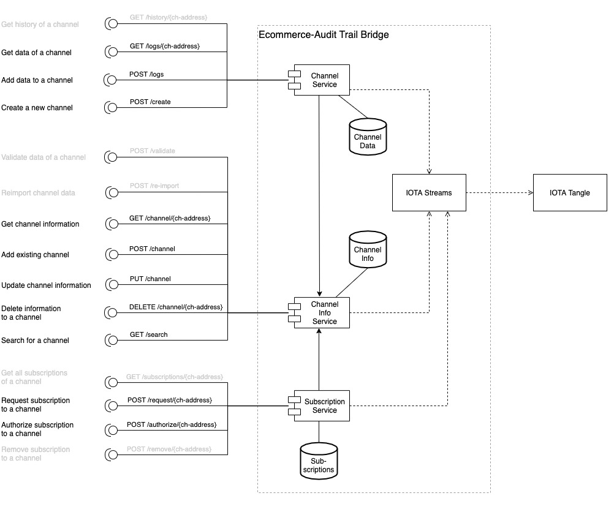
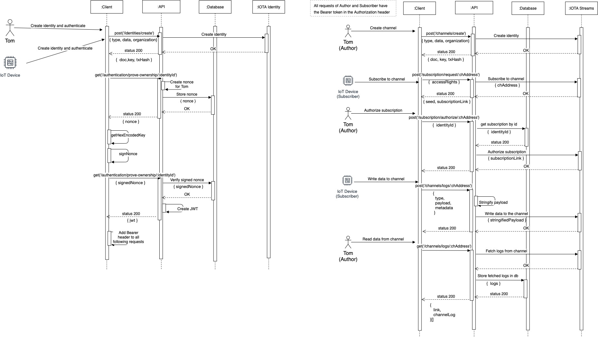

# Ecommerce-Audit Trail Gateway

<!-- I feel better to call this GW but we can go back to Bridge especially if we need to do any refactoring in case we switch to GW. This is something I want to avoid -->

The Ecommerce-Audit Trail Gateway allows users to create immutable data channels and share them with others. Channels data are stored onto the IOTA Tangle. A channels is implemented as IOTA Stream and can handle different Subscribers. <!-- really we call everything subscriber? --> By requesting a subscription to a channel a so called subscriber can request `Read`, `Write`, `ReadAndWrite` access to the channel. This request must then be authorized by the creator (Author) of the channel. After a subscriber is authorized, it is then able to write/read to/from the channel. 

> __Important:__ In order to identify and authorised subscribers (being these individuals, organizations or objects), the Audit Trail GW currently integrates with the [ecommerce-ssi bridge](./usage-ssi-bridge.md). __This means, everyone interacting with the audit trail needs to create its own identity before.__ See the corresponding documentation. The figure below shows a logic architecure with the integration of both IOTA e-commerce tools. 

In case of the Audit Trail and the GW being deployed in presence of other (centralized) Accounting, Athentication and Authorization systems this dependency will be removed.

## Use Cases 
There are two scenarios in which the Audit Trail can be used in the context of e-commerce and ENSURESEC.

### 1. _Sharing immutable and auditable data._ 
This includes small amount of data that a channel Author and writer subscribers want to share with reader subscribers. All information is contained into the Audit Trail and its source (identity of the writer subscribers) can be verified. An example includes _sharing of threats information_ detected by a sensor on a critical e-commerce infrastructure and shared to alert all other systems connected to the same infrastructure.

### 2. _Guaranteeing the immutability of large data sets._ 
This includes storing and sharing data sets maintained in large data lakes while guaranteeing that the data sets have not being altered over time or when passing across different parties. This requires that Author and writer subscribers of a channel first index the data sets, then hash them and then store on the Audit Trail (using the GW) an index and a hash of the given data sets. Authorised reader subscribers will receive access to the channel, the given data set and its index and will use the index to retrieve and compare the hash stored in the Audit Trail. An example includes storing on the Audit Trail hashes of data logs collected by e-commerce systems. This allows to perform forensing investigation in case of cyberphysical attacks to e.commerce infrastructure and to avoid altering evidence. 

<!-- in a second version and for the deliverable; I will write the above as workflow -->

## Ecommerce-Audit Trail GW APIs Definition

The list of provided APIs is shown in figure below. Endpoints which are currently not available are marked in grey.

> The api currently allows only one subscriber to a channel which is able to read and write from/to the channel. Also the author is able to read and write from/to the channel.
> 


### Channel Service 
__Prefix:__ `/api/v1/channels`

`POST /create`

Create a new channel. An author can create a new channel with specific topics where other clients can subscribe to.

_Body:_

```
{
	topics: {
        type: string,
        source: string
    }[],
	encrypted: boolean,
	seed?: string
}
```

_Response:_
```
{
    "seed": string,
    "channelAddress": string
}
```


`GET /logs/{channel-address}`

Get data from the stream. First entry is the start of the subscription. __Read__ permission is mandatory.

_Body:_

```
-
```

_Response:_
```
[
    {
        "link": string,
        "channelLog": {
            "type": string,
            "payload": any,
            "metadata"?: any
        }
    }
]
```

`POST /logs/{channel-address}`

Write data to a channel. __Write__ permission is mandatory. The `type` and `metadata` fields are not encrypted to have a possibility to search for events. The `payload` is stored encrypted for encrypted channels. 

_Body:_

```
{
    "type": string,
    "payload": any,
    "metadata"?: any
}
```

_Response:_
```
{
    "link": string
}
```


`GET /history/{channel-address}`

__TBD!__ _Get all data of a stream using a shared key. Mainly used from auditors to evaluate a log stream. Read permissions are mandatory._


### Channel Info Service 
__Prefix:__ `/api/v1/channel-info`

`POST /validate`

__TBD!__ _Validates data of a stream. Verifies data of the database against data on the tangle. If the data is verified the status field will be set to verified. Other data states are: synchronizing, outdated, malicious. If the client does not want to verify the data and trusts the status of the server it can tell the api that it only wants to receive the status._

`POST /re-import`

__TBD!__ _Re imports data into the database from the tangle. The user can decide to re import the data from the tangle into the database. A reason for it could be a malicious state of the data._

`GET /channel/{channel-address}`

Get information about a channel.

_Body:_

```
-
```

_Response:_
```
{
    "created": string,
    "authorId": string,
    "subscriberIds": string[],
    "topics": {
        type: string,
        source: string
    }[],
    "encrypted": boolean,
    "latestLink": string,
    "channelAddress": string
}
```

`POST /channel`

Add an existing channel into the database. Clients are able to add existing channels into the database so others can subscribe to them. This will be automatically called when a channel will be created.

_Body:_

```
{
    "created": string,
    "authorId": string,
    "subscriberIds": string[],
    "topics": {
        type: string,
        source: string
    }[],
    "encrypted": boolean,
    "latestLink": string,
    "channelAddress": string
}
```

_Response:_
```
-
```


`PUT /channel`

Update channel information. The author of a channel can update topics of a channel.

_Body:_

```
{
    "created": string,
    "authorId": string,
    "subscriberIds": string[],
    "topics": {
        type: string,
        source: string
    }[],
    "encrypted": boolean,
    "latestLink": string,
    "channelAddress": string
}
```

_Response:_
```
-
```


`DELETE /channel/{channel-address}`

Delete information of a channel. The author of a channel can delete its entry in the database. In this case all subscriptions will be deleted and the channel won’t be found in the system anymore. The data & channel won’t be deleted from the tangle since its data is immutable on the tangle!

_Body:_

```
-
```

_Response:_
```
-
```

`GET /search`

Search for a channel. A client can search for a channel which he is interested in.


### Subscription Service 
__Prefix:__ `/api/v1/subscription`

`GET /subscriptions/{channel-address}`

__TBD!__ _Get all subscriptions of a channel._

`POST /request/{channel-address}`

Request subscription to a channel. A client can request a subscription to a channel which he then is able to read/write from. The subscriber can use an already generated seed or let it generate by the api so in this case the seed should be undefined.

_Body:_

```
{
    "accessRights": "ReadAndWrite" | "Read" | "Write",
    "seed"?: string
}
```

_Response:_
```
{
    "seed": string,
    "subscriptionLink": string,
}
```

`POST /authorize/{channel-address}`

Authorize a subscription to a channel. The author of a channel can authorize a subscriber to read/write from a channel.

_Body:_

```
{
    "identityId": string
}
```

_Response:_
```
{
    "keyloadLink": string,
}
```

`POST /remove/{channel-address}`

__TBD!__ _Remove subscription to a channel. The author or subscriber of a channel can remove a subscription from a channel. (A subscriber can only remove its own subscription)_


## HowTo: Create a channel, add a subscriber and read + write from it

The following sequence diagram demonstrates the requests need to write and read to/from a channel. The sequence diagram indicates two users: Tom which becomes the author and a IoT Device which is the subscriber.



1. Each of the users trying to write or read from a channel needs to create an identity at the api
2. Each of the identity must authenticate at the api in order to authenticate the requests are legit
3. One identity must create a channel (in this case Tom), this identity becomes the author of the channel and is able to authorize further identities to read and write from/to the channel
4. The second identity can request a subscription to the channel so it is able to read or write
5. The author is then able to authorize this suscription
6. After the author authorized the IoT Device it is able to write data to the channel
7. The author is then able to fetch the logs of the IoT Device
